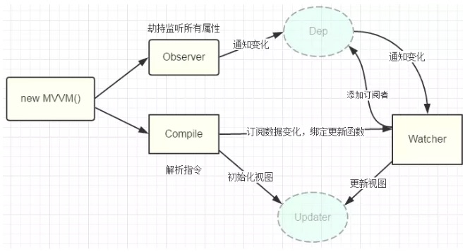

# vue-like

> 学习项目

## 零、基础说明

### 1、双向数据绑定

View的变动，自动反映在 ViewModel，反之亦然。 Vue 中是基于`数据劫持`的双向绑定，当前版本基于 `Object.defineProperty` 实现，3.0 版本将基于 `Proxy` 实现（严格来讲这个应该叫代理，不过可以按劫持来理解）。

### 2、Object.defineProperty

这里说到的`数据劫持`，通常我们利用 Object.defineProperty 劫持对象的访问器（即显示声明`访问描述符`），在属性值发生变化时就可以获取变化，从而进行进一步操作。

数据劫持的优点：
1. 无需显式调用
    - 响应式编程，书写简单，不需要显式调用如 setState 
2. 更新粒度控制的好
    - 可精确得知数据变化，减少计算带来的性能损耗

### 3、实现双向数据绑定的思路

1. 利用 Proxy 或 Object.defineProperty 生成的 `Observer` 针对对象/对象的属性进行“劫持”(`发布订阅模式`)，在属性发生变化后通知订阅者
2. 解析器 `Compile` 解析模板中的 `Directive`(指令)，收集指令所依赖的方法和数据(`依赖收集`)，等待数据变化然后进行渲染
3. `Watcher` 属于 Observer 和 Compile 桥梁，它将接收到的 Observer 产生的数据变化，并根据 Compile 提供的指令进行视图渲染，使得数据变化促使视图变化

## 一、响应式数据（双向数据绑定）

### 代码实现

1. 构造实例时，先收集 options 上 data 的依赖（即 observer(options.data)）
2. observer 实际执行的是，遍历 data 可枚举属性，添加数据劫持（即 Observer + defineReactive）
    - setter 中要注意，值更新才需要执行，且更新后要将新值赋给 val 供 getter 使用新的数据
    - 需要深度劫持，所以在上面添加数据劫持操作的时候 observer(val) ，新值也要同样处理 observer(newVal)
3. 为了简化操作，直接用 this.x 替代 this._data.x ，需要代理一下（Vue.prototype._proxy）
    - 代理时，getter 操作的是 this._data.x
    - 代理时，setter 操作的也是 this._data.x

## 二、模板解析

### 代码实现

1. Vue 构造执行的最后，创建一个 Compile 实例，用于模板解析
2. 为了提高渲染效率，使用 fragment 处理，解析处理占位符完成后，再将其插回到 DOM 节点中
3. 解析过程
    - 正则匹配 {{x}} 格式内容
    - 如果节点是文本节点（nodeType 为3）且能成功匹配，则进入 replace 操作
        - 匹配成功后，获取占位的属性访问，如 a.b 
        - 处理属性访问，从 _data 中获取对应的属性值
        - 用正则和属性值替换文本节点内容，并覆盖
    - 递归处理标签类型子节点

## 三、渲染

需要使用发布订阅模式将 observe 和 compile 联系起来（即视图响应数据变化进行更新）。

### 1、发布订阅模式

- 发布订阅中心（消息管理员）Dep
    - 存储所有的订阅者，addSub 方法可用于添加新的订阅者
    - notify 方法用于通知所有的订阅者进行更新，即调用订阅者 Watcher 实例的 update 方法
- 发布者 Observer
    - 缓存数据 val ，并遍历数据所有可枚举属性进行监听（数据劫持）
    - 监听即显式定义访问操作符，getter 依赖收集、setter 触发更新
- 订阅者 Watcher
    - 初始化的时候，参数为订阅成功后，发布触发数据更新时执行的回调函数
    - 约定必须有一个 update 方法，用于 Dep 统一调度
